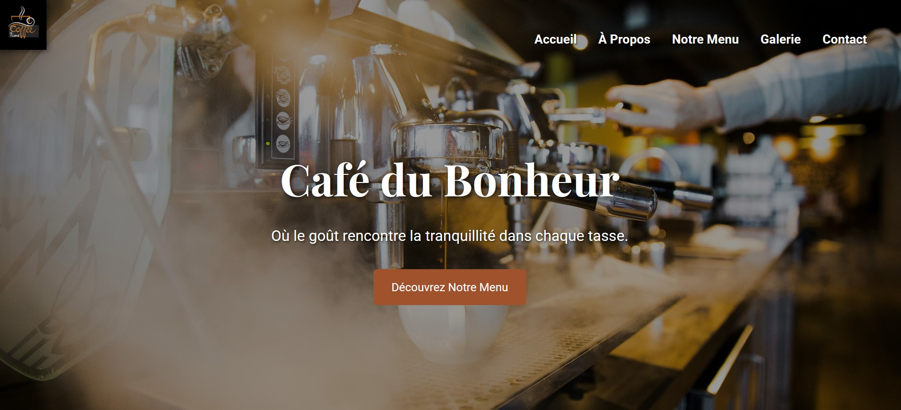
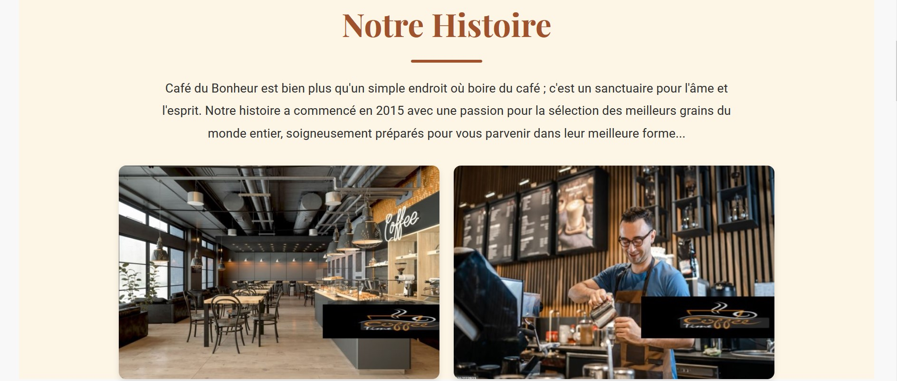
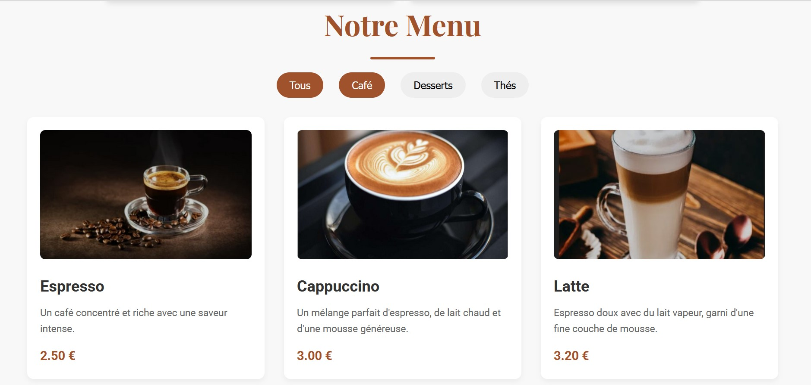

<h1>Café du Bonheur</h1>

    Ce projet est une application web interactive conçue pour présenter de manière attrayante et responsive un café fictif nommé "Café du Bonheur". Développée en utilisant HTML, CSS et JavaScript, cette application vise à attirer les visiteurs, à afficher la carte du café, à mettre en valeur l'ambiance générale et les produits à travers une galerie de photos, et à fournir des informations de contact et de localisation aux utilisateurs.

<h2>✨ Fonctionnalités</h2>
<ul>
    <li><b>Page d'Accueil Attrayante (Hero Section) :</b> Comprend une image de fond immersive du café, un titre principal accrocheur, un texte descriptif et un bouton d'appel à l'action.</li>
    <li><b>Barre de Navigation Intuitive (Header/Navigation Bar) :</b> Une barre علوية transparente et claire intégrant le logo du café et des liens de navigation faciles d'accès vers les différentes sections du site (telles que : Accueil, À Propos, Menu, Galerie, Contact).</li>
    <li><b>Section "Happiness Cups" :</b> Présentation des cafés ou boissons spéciales du café, organisée dans une grille avec une description pour chaque article.</li>
    <li><b>Menu Détaillé du Café (Menu Section) :</b> Une section dédiée à l'affichage des diverses catégories de la carte. Chaque élément du menu comprend une image, un nom, une description et un prix.</li>
    <li><b>Galerie Photo Visuelle (Gallery Section) :</b> Pour afficher des photos du café, de son ambiance ou de ses produits dans une disposition en grille attrayante.</li>
    <li><b>Section "À Propos" (About Section) :</b> Fournit des informations sur l'histoire, la mission ou le concept du café.</li>
    <li><b>Section Témoignages Clients (Testimonials Section) :</b> Présentation des avis et expériences des clients.</li>
    <li><b>Localisation et Horaires (Location & Hours Section) :</b> Informations pratiques incluant l'adresse du café, les heures d'ouverture et une carte interactive (via une iframe Google Maps) pour faciliter l'accès.</li>
    <li><b>Formulaire de Contact (Contact Form) :</b> Un formulaire simple permettant aux visiteurs de contacter directement le café.</li>
    <li><b>Liens de Réseaux Sociaux (Social Links) :</b> Intégration d'icônes et de liens vers les profils du café sur les plateformes de médias sociaux.</li>
    <li><b>Design Responsive :</b> Le site est conçu pour s'adapter et offrir une expérience utilisateur optimale sur diverses tailles d'écran (ordinateurs de bureau, tablettes, smartphones).</li>
</ul>

<h2>💻 Technologies utilisées</h2>
<ul>
    <li><b>HTML5 :</b> Structure et contenu de la page web.</li>
    <li><b>CSS3 :</b> Style, mise en page responsive et esthétique de l’interface utilisateur.</li>
    <li><b>JavaScript :</b> Logique applicative de base pour l'interactivité (par exemple, navigation mobile, effets visuels).</li>
</ul>

<h3>Comment exécuter l'application sur votre ordinateur</h3>

Pour lancer l'application sur votre ordinateur, suivez ces étapes simples :

<ul>
    <li>1. Clonez ce dépôt GitHub sur votre machine locale en utilisant la commande <code>git clone</code>.</li>
    <li>2. Ouvrez le dossier du projet avec votre éditeur de code ou environnement de développement préféré.</li>
    <li>3. Ce projet ne nécessite pas d'installation de dépendances complexes.</li>
    <li>4. Lancez l'application en ouvrant le fichier <code>index.html</code> dans un navigateur web.</li>
    <li>5. L'interface s'ouvrira alors dans votre navigateur, vous permettant d'utiliser toutes les fonctionnalités.</li>
</ul>

Assurez-vous d'avoir un environnement compatible pour garantir une expérience fluide.

<h2>Fonctions utilitaires partagées</h2>

Ce module regroupe les fonctions essentielles qui assurent la qualité et la fluidité de l'expérience utilisateur, même pour un site principalement statique. Parmi ces fonctions, on retrouve :

<ul>
    <li><strong>Animations et Transitions :</strong> Gestion des animations CSS pour une interface plus dynamique et engageante.</li>
    <li><strong>Vérification de la Réactivité :</strong> S'assurer que tous les éléments s'adaptent correctement aux différentes tailles d'écran.</li>
</ul>

Ces fonctionnalités contribuent à offrir une interface intuitive et réactive, améliorant l'attrait visuel et l'expérience de navigation.

<h3>Image de l'application en fonctionnement</h3>

Ces images montrent les principales interfaces de l’application en action, telles que la page d'accueil, les sections de contenu, la galerie et la vue responsive.

<h3>Page d'Accueil :</h3>

<h3>Section Menu :</h3>

<h3>Galerie de Photos :</h3>

<h3>Design Responsive (vue mobile) :</h3>

    <a href="LIEN_VIDEO_DEMO_ICI" target="_blank">Lien vers la vidéo de démonstration</a>

    <strong>Développé par :</strong> PixelPioneers 
    <strong>Encadré par :</strong> Prof Abdelmoula Abouhilal 
    <strong>Année :</strong> 2025

